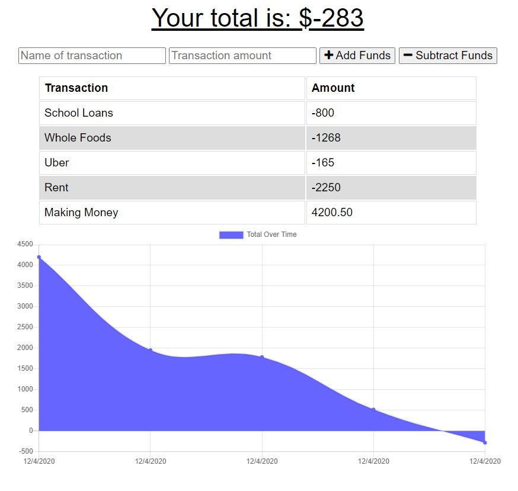

# 18 - Budget Tracker

## Description

Using Express, Mongoose, and Mongodb, this app will allow the user to track their budget allowing them to enter current transactions, (both income and expendatures, and view the model in a graph format. Will maintain a record through the mongodb.

### Screenshot

#### Link to Deployed Application
[Github Link](https://github.com/scotwoodland/BudgetTracker) is hosted on Github pages.
[Deployed URL Link](https://mighty-hollows-04975.herokuapp.com/) is hosted on Heroku.

This application was authored by Scot Woodland.
